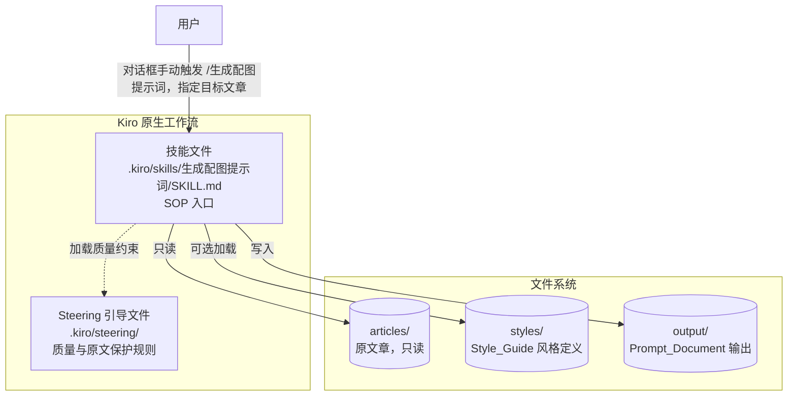
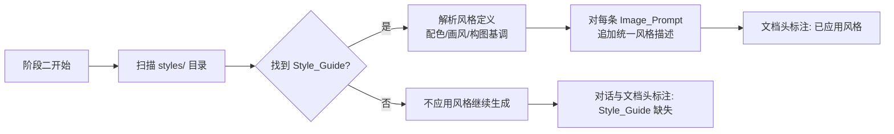
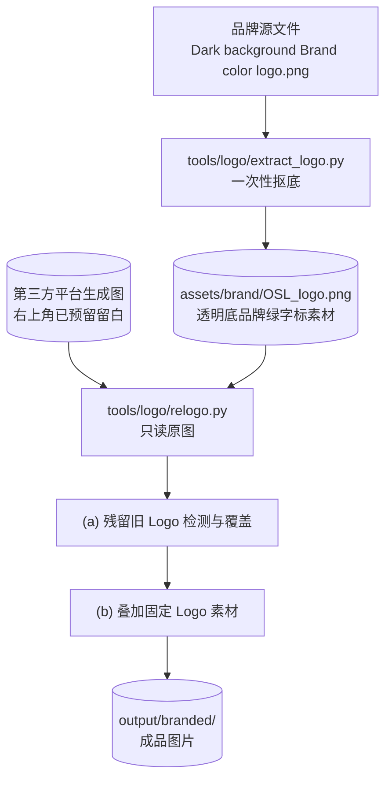

# 设计文档

## 概述

「Markdown 智能配图提示词提取流水线」是一套 **Kiro 原生工作流**，而非传统意义上的代码应用程序。它的「实现产物」主要是一组用 Markdown 编写的指令文件（Agent Skill 技能文件、Steering 引导文件）以及一套约定的项目目录结构。真正的「运行时」是 Kiro 的智能体（LLM Agent）：当用户在对话框中手动触发技能 `/生成配图提示词` 时，Kiro 读取技能文件中的标准作业程序（SOP），结合 Steering 引导文件中的质量约束，按三阶段流程读取原文、生成提示词、归档输出。

本设计的核心目标是把需求文档中的需求落地为：

- 一套清晰的目录结构（需求 1）
- 一个编码了三阶段 SOP 的技能文件（需求 2、3、4）
- 一组保证质量与原文安全的 Steering 引导文件（需求 5、6）
- 一种风格定义文件（Style_Guide）的加载与应用机制（需求 3.5–3.7）
- 一套**按字数节奏与结构转换确定配图数量与挂载位置**的配图节奏机制（需求 7）：阶段一在梳理结构时即据此选定一组 **Image_Slot**（不再机械地「每段一图」）。
- 一套为每张配图生成 **Alt 文本（Alt_Text）与图片说明（Caption）** 的 SEO 元数据机制（需求 8）：阶段二在生成每条提示词时同步产出。
- 一份结构化、易复制的输出文档模板（需求 4）
- 一套**出图后的 Logo 后期合成（Logo_Compositing）机制**（需求 9）：生图阶段不再让模型绘制 Logo，而是在提示词中要求模型在右上角预留干净空白（Logo_Reserve_Zone，AC 3.9）；待图片生成后，由一段**确定性脚本**（`tools/logo/relogo.py`）将固定的透明底 Logo 素材（`assets/brand/OSL_logo.png`）以统一尺寸与边距叠加到每张图片的右上角，成品写入 `output/branded/`。
- 一套适配「Markdown 指令型工作流」的测试与校验策略

阶段分工说明：**配图节奏（依据正文字数节奏与结构转换处选定 Image_Slot）发生在阶段一**，作为后续生成提示词数量与挂载位置的依据（需求 7）；**Alt_Text 与 Caption 元数据的生成发生在阶段二**，与每条 Image_Prompt 同步产出（需求 8）；阶段三做规范化命名、结构化渲染与存储；**Logo 后期合成发生在「出图之后」**——它是一个独立于提示词流水线的确定性后处理步骤：先由第三方平台依据 Prompt_Document 生成图片，再由脚本统一叠加 Logo 并输出到 `output/branded/`（需求 9）。

由于绝大部分「行为」由 LLM 解释执行，本设计的可自动化测试聚焦于其中**确定性、可抽取为纯函数/校验器**的部分（命名派生、目录幂等、输出结构、顺序保持、路径隔离、分类与图片类型一致性、**配图节奏的槽位选择规则**、**Alt_Text/Caption 的非空与长度约束及 render/parse 往返**），其余依赖语义判断的行为（数据研判、提示词生成、忠于原文，以及 **Alt/Caption 的长尾关键词自然融入与忠于图意**）通过场景化人工校验与示例校验覆盖。

### 设计原则

1. **指令即实现**：技能文件与引导文件是「源代码」，它们必须精确、无歧义、可被 LLM 稳定复现。
2. **确定性下沉**：凡是可以变成确定性规则的部分（命名、路径、结构、顺序）都写成明确的、可校验的约定，减少 LLM 自由发挥空间。**这一原则同样适用于品牌 Logo 的呈现**——精确的尺寸（画宽 8%）、位置（距顶/右各 60px）与字形属于定量空间指令，扩散模型无法可靠执行且每次重绘会导致大小不一/字母错位，故将其从生图模型剥离、下沉给确定性脚本（`tools/logo/relogo.py`）在出图后统一合成，确保逐字节一致（需求 9）。
3. **原文只读不可变**：流水线对 `articles/` 永远只读，所有产物只写入 `output/`。Logo 后期合成同理——对原始生成图片只读，成品另写入 `output/branded/`（需求 9.8）。
4. **优雅降级**：Style_Guide 缺失、目录缺失等情况不应中断主流程，而应给出明确状态报告。

## 架构

### 组件总览



### 三阶段 SOP 数据流

```mermaid
flowchart TD
    Start([用户触发技能并指定目标文章]) --> Init["目录就绪检查<br/>需求 1"]
    Init --> P1Read{"目标文章存在?<br/>需求 2.1/2.2"}
    P1Read -->|否| ErrMissing[报告文件未找到并终止]
    P1Read -->|是| P1Analyze

    subgraph "阶段一 结构研判"
        P1Analyze["只读读取原文<br/>分析数据特征<br/>梳理逻辑结构<br/>需求 2.3-2.6"]
        P1Analyze --> Classify["逐段分类<br/>Data_Rich_Segment / Logic_Segment"]
        Classify --> Cadence["按配图节奏选定 Image_Slot 集合<br/>H2/主题切换布点 + 超 500 字补点<br/>短同主题章节合并 + 引言槽标记 Hero_Image<br/>需求 7"]
        Cadence --> SlotCtx["仅为选定 Image_Slot 提取生图上下文<br/>需求 2.7"]
    end

    SlotCtx --> P2Style["加载 styles/ 下的 Style_Guide<br/>需求 3.5"]
    subgraph "阶段二 提示词生成"
        P2Style --> StyleExist{"Style_Guide 存在?<br/>需求 3.6/3.7"}
        StyleExist -->|是| P2Gen[生成提示词并应用统一风格]
        StyleExist -->|否| P2GenNoStyle["生成提示词不应用风格<br/>报告 Style_Guide 缺失"]
        P2Gen --> Meta
        P2GenNoStyle --> Meta["为每条提示词生成 Alt_Text 与 Caption<br/>需求 8"]
        Meta --> Prompts["Image_Prompt 集合<br/>含 段落/类型/描述/Alt/Caption 五字段"]
    end

    subgraph "阶段三 规范化输出"
        Prompts --> Name["派生输出名<br/>Article_Name + aimage.md<br/>需求 4.2"]
        Name --> Dup{"output/ 同名文件?<br/>需求 4.5"}
        Dup -->|是| Warn[覆盖前提示用户]
        Dup -->|否| WriteDoc
        Warn --> WriteDoc["按行文顺序写入 Prompt_Document<br/>每条含五字段（含 Alt/Caption）<br/>需求 4.1/4.3/4.4/4.5"]
        WriteDoc --> ReportPath["报告输出文件完整路径<br/>需求 4.6"]
    end

    ReportPath --> Gen3rd["用户携 Prompt_Document<br/>赴第三方平台生成图片"]

    subgraph "出图后 Logo 后期合成（确定性脚本，需求 9）"
        Gen3rd --> Relogo["tools/logo/relogo.py<br/>只读原图"]
        Relogo --> Residual{"右上角残留旧 Logo?<br/>需求 9.5/9.6"}
        Residual -->|是| Cover["连通域定位 OSL bbox<br/>局部背景中位数覆盖<br/>不动合法绿内容"]
        Residual -->|否| Overlay
        Cover --> Overlay["叠加固定 Logo 素材<br/>宽=画宽 8%、距顶/右 60px<br/>需求 9.2/9.3/9.4"]
        Overlay --> Branded[("output/branded/<br/>成品图片<br/>需求 9.7")]
    end

    Branded --> End([完成])
```



### 执行模型

- **触发方式**：手动。用户在 Kiro 对话框输入技能命令 `/生成配图提示词`，并指明目标文章（如「为 articles/AI趋势.md 生成配图提示词」）。
- **解释器**：Kiro 智能体读取 `SKILL.md` 的 SOP，逐阶段执行；过程中显式加载 `.kiro/steering/` 的引导文件以约束行为。
- **副作用边界**：读取范围为 `articles/`、`styles/`、`.kiro/steering/`；写入范围严格限定为 `output/`（目录初始化时可创建空目录，但不修改 `articles/` 内任何已有文件）。
- **Logo 后期合成边界**：`tools/logo/relogo.py` 在出图后独立运行，对原始生成图片**只读**，成品另写入 `output/branded/`；该步骤为纯图像后处理，独立于提示词流水线与 TS 校验库（需求 9.7、9.8）。

## 组件与接口

### 1. 目录结构与各文件职责（需求 1）

```
项目根目录/
├── articles/                         # 输入：原文章（只读，需求 6）
│   └── [Article_Name].md
├── styles/                           # 风格定义目录（需求 3.5-3.7）
│   └── Style_Guide.md                # 可选：用户提供的统一视觉风格定义
├── output/                           # 输出：生成的提示词文档（需求 4）
│   └── [Article_Name]aimage.md
└── .kiro/
    ├── skills/                       # 技能目录（需求 1）
    │   └── 生成配图提示词/
    │       └── SKILL.md              # 核心流水线技能文件（SOP 入口）
    └── steering/                     # 引导文件目录（需求 5、6）
        ├── image-prompt-quality.md   # 质量把控：忠于原文、结构清晰、易复制
        └── source-protection.md      # 原文保护：只读访问、产物只写 output/
```

| 路径 | 角色 | 关联需求 |
| --- | --- | --- |
| `articles/` | 待处理原文章的只读输入区 | 1, 2.1, 6 |
| `styles/` | 风格定义文件（Style_Guide）专用目录，文件缺失也需预留目录 | 1, 3.5-3.7 |
| `output/` | 生成的 `[Article_Name]aimage.md` 输出区 | 1, 4 |
| `.kiro/skills/生成配图提示词/SKILL.md` | 编码三阶段 SOP 的核心技能文件，流水线入口 | 1, 2, 3, 4 |
| `.kiro/steering/image-prompt-quality.md` | 提示词质量规则（忠于原文、不臆造、结构清晰、易复制） | 5 |
| `.kiro/steering/source-protection.md` | 原文保护规则（只读、产物只写 output/） | 6 |

### 2. 技能文件设计（`SKILL.md`）

技能文件是流水线的「源代码」，它以自然语言 + 结构化步骤编码三阶段 SOP。其内容结构如下：

**(a) 元信息与触发说明**
- 技能名：`/生成配图提示词`
- 用途：为 `articles/` 下指定的 Markdown 文章生成结构化配图提示词文档。
- 输入参数：目标文章名（或路径）。
- 前置动作：显式加载 `.kiro/steering/image-prompt-quality.md` 与 `.kiro/steering/source-protection.md`，并在内部确认这些约束生效（需求 5.1）。

**(b) 阶段零：目录就绪（需求 1）**
1. 检查 `articles/`、`.kiro/steering/`、`.kiro/skills/`、`styles/`、`output/` 五个目录是否存在。
2. 对缺失的目录执行创建；对已存在的目录保持其内已有文件不变。
3. 汇报每个目录的就绪状态。

**(c) 阶段一：文章类型研判与结构梳理（需求 2、7）**
1. 以只读方式读取 `articles/` 下用户指定的目标 Article。
2. 若文件不存在，输出「文件未找到」错误并终止。
3. 分析全文及各段落是否包含详细数据/统计信息。
4. 梳理逻辑结构与关键节点。
5. 将每个段落标记为 `Data_Rich_Segment`（含详细数据）或 `Logic_Segment`（纯逻辑），且**每个段落有且只有一个标记**。
6. **按配图节奏选定 Image_Slot（需求 7）**：依据正文字数节奏与结构转换处确定一组 Image_Slot——在每个 H2/主题切换处布点；相邻槽间正文超约 500 字时在语义边界补点；短（不足约 300 字）且同主题的连续章节合并为一槽；在引言/开篇章节设题图槽并标记为 `Hero_Image`。统计触发字数时仅计正文文字，排除代码块、表格、引用块、参考文献与 FAQ 列表。仅为选定的 Image_Slot 对应段落/小标题提取生图上下文（需求 2.7）。

**(d) 阶段二：提示词策略生成（需求 3、8）**
1. 对 `Data_Rich_Segment`：生成「数据可视化」类提示词（数据图表、信息图表、量化对比图等）。
2. 对 `Logic_Segment`：生成「概念表达」类提示词（逻辑对比图、概念思维导图、场景插画等）。
3. 为每条提示词记录三字段：**对应段落/小标题、图片类型、具体画面/图表描述**。
4. 画面/图表描述**只能来源于原文已有信息**（引用 `image-prompt-quality.md` 的忠实性约束）。
5. **为每条提示词生成 Alt_Text 与 Caption（需求 8）**：
   - **Alt_Text**：一句话讲清配图主体与结论，长度 **≤ 125 字符**；自然融入 1–2 个长尾关键词（不堆砌）；忠于图意、仅描述图中确实存在的主体与结论；**不以「图片」或「image of」开头**。
   - **Caption**：比 Alt_Text 更完整，点明配图看点或关键数据；可在适当处标注数据来源（与图内「Source」呼应）；同样自然融入长尾关键词；与 Alt_Text **互补而非照抄**。
   - 长尾关键词仅从文章标题、对应段落/小标题及原文关键术语中提炼，不引入原文未包含的词（需求 8.9）。
6. 从 `styles/` 加载 Style_Guide：
   - 若存在：让每一条提示词都应用其中定义的统一风格（配色、画风、构图基调等），并在文档头部标注「已应用风格」。
   - 若不存在：跳过风格应用继续生成，并在文档头部与对话中报告「Style_Guide 缺失」。

**(e) 阶段三：规范化输出与存储（需求 4）**
1. 派生输出文件名：`Article_Name`（原文件名去除 `.md`）+ `aimage.md`。
2. 若 `output/` 已存在同名文档，在覆盖前提示用户。
3. 按**原文行文顺序**写入所有提示词，每条包含五字段（三字段 + Alt_Text + Caption）。
4. 写入完成后报告输出文件的完整路径。

### 3. Steering 引导文件设计（需求 5、6）

为避免污染全局对话，引导文件采用「技能显式引用 + 路径匹配」的加载方式：技能文件在阶段零显式读取这两个引导文件；同时引导文件可配置 `inclusion: fileMatch`（匹配 `output/**`、`articles/**`）作为兜底。

**`image-prompt-quality.md`（质量把控，需求 5）**
- 忠实性：提示词必须高度忠于原文信息（5.2）。
- 不臆造：仅依据原文已有信息生成，不得引入原文未包含的内容、数据或结论（5.3）。
- 可复制性：输出文档结构清晰、字段齐全、排版易读，便于用户直接复制单条提示词前往第三方平台生图（5.4）。
- 三字段规范：每条提示词必须含「对应段落/小标题、图片类型、画面/图表描述」。

**`source-protection.md`（原文保护，需求 6）**
- 只读：流水线对 `articles/` 全程只读访问（6.1）。
- 不可变：执行前后 `articles/` 内每篇文章内容必须完全一致（6.2）。
- 写入隔离：所有生成内容只写入 `output/`，禁止写入 `articles/`（6.3）。

### 4. Style_Guide 加载与应用机制（需求 3.5–3.7）



- **加载来源**：`styles/` 目录下的 Markdown 文件（约定主文件名为 `Style_Guide.md`；若目录内存在多个文件，技能选取约定主文件或在对话中请用户确认）。
- **应用方式**：将 Style_Guide 中的视觉约束（配色、画风、构图基调等）统一附加到**每一条** Image_Prompt 的描述中，确保整篇配图风格一致（3.6）。
- **缺失处理**：目录不存在文件时，不应用统一风格、继续生成，并向用户报告缺失状态（3.7），保证流程不中断（优雅降级）。

### 5. 输出文档模板（需求 4）

`output/[Article_Name]aimage.md` 采用如下模板，确保结构清晰、字段齐全、易于复制：

```markdown
# [Article_Name] 配图提示词文档

> 源文章：articles/[Article_Name].md
> 统一风格：已应用（styles/Style_Guide.md） | 未应用（Style_Guide 缺失）
> 提示词总数：N

---

## 1. {对应段落 / 小标题}

- **图片类型**：数据可视化 — 量化对比图（或：概念表达 — 概念思维导图 等）
- **画面 / 图表描述**：
  {一段可直接复制到第三方生图平台的、忠于原文的具体描述}
- **Alt 文本**：{≤125 字符、忠于图意、自然融入 1-2 长尾关键词、不以「图片/image of」开头}
- **图片说明**：{比 Alt 更完整、点明看点或关键数据、可标 Source、与 Alt 互补}

---

## 2. {对应段落 / 小标题}

- **图片类型**：...
- **画面 / 图表描述**：
  ...
- **Alt 文本**：...
- **图片说明**：...
```

- 提示词条目按**原文行文顺序**编号排列（4.3）。
- 每条目固定包含五字段：标题位置承载「对应段落/小标题」，列表项承载「图片类型」「画面/图表描述」，并在描述之后追加「Alt 文本」与「图片说明」两项（4.4、4.5、需求 8）。
- 题图（Hero_Image）通常为第 1 条目（引言/开篇槽，需求 7.4）。
- 文档头部声明源文章、风格应用状态、提示词总数，便于用户快速核对。

### 6. 确定性校验库模块（tools/validator）

技能产物中确定性的逻辑抽取到 `tools/validator` 校验库（TypeScript + `fast-check`）以支持属性化测试。为覆盖新增需求，需对该库做如下扩展：

- **`src/document.ts`（扩展）**：`ImagePrompt` 接口新增 `altText`、`caption`（及 `isHero`）字段；`renderDocument` 在「画面/图表描述」之后渲染 `- **Alt 文本**：…` 与 `- **图片说明**：…` 两行；`parsePrompts` 同步解析这两项，使五字段与 render/parse 严格往返（需求 4.5、需求 8，对应 Property 13、Property 14）。
- **`src/cadence.ts`（新增）**：承载配图节奏逻辑——
  - `selectImageSlots(sections: SectionInput[]) => ImageSlot[]`：按需求 7 的规则确定槽位集合（H2/主题切换布点、超阈值补点、短同主题章节合并、引言题图标记）。
  - `wordCount(rawSegmentText): number`：统计触发字数，排除代码块、表格、引用块、参考文献与 FAQ 列表（需求 7.5）。
  - 二者均为无副作用纯函数，供 Property 11、Property 12 测试。
- 其余既有模块（`naming.ts`、`dirs.ts`、`classification.ts`、`safety.ts`）保持不变。

### 7. Logo 后期合成模块（tools/logo）

Logo 的尺寸/位置/字形属于定量空间指令，交由确定性脚本在出图后统一处理（需求 9）。该模块为纯图像后处理，**独立于提示词流水线与 TS 校验库**，运行依赖临时 Python venv + `Pillow` + `scipy`。



**(a) Logo 素材抠底脚本 `tools/logo/extract_logo.py`（一次性产物）**

从品牌源文件生成统一的透明底字标素材，步骤如下：
1. 识别绿字像素并裁切到「OSL」字形紧致边界框，顺带剔除外圈灰色边框；
2. 以「绿度（绿通道减蓝通道）」估计每个像素的覆盖 alpha，形成**抗锯齿**的平滑边缘；
3. 前景 RGB 统一设为品牌绿 `#B3FF38`（RGB `179,255,56`），避免边缘暗色脏边；
4. 输出透明底 PNG 到 `assets/brand/OSL_logo.png`。

该脚本只需运行一次，产物 `assets/brand/OSL_logo.png` 即为后期合成阶段反复复用的固定素材。

**(b) Logo 后期合成脚本 `tools/logo/relogo.py`**

对每张生成图（**只读**）执行两步处理，输出到 `output/branded/`：

- **残留旧 Logo 检测与覆盖（需求 9.5、9.6）**：若生图模型仍在右上角自绘了 Logo，脚本：
  1. 在右上区域查找所有品牌绿连通块；
  2. 以「最贴右上极角」的块为**种子**（`corner_d = (w - x1) + y0` 最小）；
  3. 迭代合并与当前 bbox **垂直带重叠**（重叠 ≥ 种子高度的 `Y_OVL`）、且**水平间距很小**（`gap ≤ X_GAP`）的相邻字母块，向左扩展，从而把分离的 O/S/L 字母块并为完整「OSL」bbox；合并宽度受 `MAX_W` 护栏约束，防止误并远处内容；
  4. 用该 bbox 紧邻区域的**局部背景中位数色**覆盖。
  - **严格不触碰**与种子处于不同 `y` 带的合法绿色内容（数据标签、绿表头、分隔线、图表元素）——它们因垂直重叠不足而不会被并入 bbox。
- **叠加固定 Logo（需求 9.2、9.3、9.4）**：将 `assets/brand/OSL_logo.png` 缩放到「画宽 8%」，置于右上角、距顶/右各 60px，做 alpha 合成；同一批次所有图使用相同素材、相同相对尺寸与相同边距，确保 Logo 逐字节一致（需求 9.9）。
- **输出（需求 9.7）**：成品写入 `output/branded/`，原图只读不改（需求 9.8）。

**关键参数**

| 参数 | 值 | 含义 |
| --- | --- | --- |
| `LOGO_WIDTH_RATIO` | `0.08` | Logo 宽度占画宽比例（8%，2048 画布约 164px） |
| `MARGIN` | `60` | 距顶边 / 右边的外边距（像素） |
| 素材路径 | `assets/brand/OSL_logo.png` | 固定透明底字标素材 |
| 输出目录 | `output/branded/` | 成品图片目录 |
| `X_GAP` | `90` | 字母块合并的最大水平间距 |
| `Y_OVL` | `0.5` | 字母块合并要求的最小垂直重叠比例（相对种子高度） |
| `MAX_W` | `420` | 合并 bbox 的最大宽度护栏，防止误并远处内容 |

**运行依赖**：临时 Python venv + `Pillow`（图像合成）+ `scipy`（`ndimage` 连通域分析）。纯图像后处理，与提示词流水线、`tools/validator`（TS + fast-check）相互独立。

**SKILL.md 设计描述同步更新（需求 9、AC 3.9）**

- **阶段二/输出阶段的提示词约束**：每条 Image_Prompt 须包含「**右上角预留干净空白、不绘制 OSL Logo/字母/文字**」的指令（正向预留 + 负向禁绘），对应 AC 3.9 与需求 9.1。该约束的英文负向措辞与 `styles/Style_Guide.md` 第 1.1 节保持一致。
- **流程末尾新增「Logo 后期合成」步骤说明**：在阶段三之后补充说明——Prompt_Document 仅产出「预留留白」的提示词；用户赴第三方平台出图后，运行 `tools/logo/relogo.py` 统一叠加 Logo 并输出 `output/branded/`（对应需求 9 全部条款）。

## 数据模型

虽然产物以 Markdown 为主，但为了把确定性逻辑抽象为可测试的纯函数/校验器，定义以下概念数据模型（可作为可选的轻量校验脚本的内部结构）。

### SegmentClassification（段落分类，需求 2.5/2.6）

```
enum SegmentClassification {
  DATA_RICH   // 含详细数据/统计信息
  LOGIC       // 纯逻辑论述
}
```

- 不变量：每个被处理的段落映射到**且仅映射到**一个分类值。

### ImageType（图片类型，需求 3.1/3.2）

```
enum ImageTypeCategory {
  DATA_VISUALIZATION   // 数据可视化：数据图表、信息图表、量化对比图...
  CONCEPT_EXPRESSION   // 概念表达：逻辑对比图、概念思维导图、场景插画...
}
```

- 约定映射：`DATA_RICH → DATA_VISUALIZATION`，`LOGIC → CONCEPT_EXPRESSION`。

### ImagePrompt（生图提示词，需求 3.3/4.4/4.5/8）

```
ImagePrompt {
  segmentRef:   string   // 对应段落或小标题（非空）
  imageType:    string   // 图片类型（非空，归属某 ImageTypeCategory）
  description:  string   // 具体画面/图表描述（非空，仅源于原文）
  altText:      string   // Alt 文本（非空，≤125 字符，含 1-2 长尾关键词，需求 8.1-8.5/8.9）
  caption:      string   // 图片说明（非空，信息比 Alt 更完整、与 Alt 互补，需求 8.1/8.6-8.8）
  classification: SegmentClassification  // 内部记录，用于一致性校验
  order:        int       // 在原文中的出现序号（从 0 或 1 递增）
  isHero:       bool       // 是否为题图（Hero_Image，引言/开篇槽，需求 7.4）
}
```

- 不变量（需求 8）：`altText` 与 `caption` 均为**非空**；`altText` 的长度 **≤ 125 个字符**（需求 8.2）；`altText` 不以「图片」或「image of」之类词语开头（需求 8.5）；`altText` 与 `caption` 互补、**不内容重复**（需求 8.7）。
- `isHero` 标记来源于配图节奏：引言/开篇 Image_Slot 对应的提示词 `isHero=true`，全文有且仅有一条（需求 7.4）。

### Image_Slot（配图位置，需求 7）

阶段一在梳理结构后，按配图节奏在原文中选定一组「配图位置」。一个 Image_Slot 对应阶段二生成的一条 Image_Prompt。

```
ImageSlot {
  segmentRef:     string                 // 该槽位挂载的段落或小标题（非空）
  order:          int                    // 在原文中的出现序号（升序 = 行文顺序）
  classification: SegmentClassification  // 该槽位所属段落的分类（决定图片类型类别）
  isHero:         bool                    // 是否为题图槽（引言/开篇，需求 7.4）
}
```

- 不变量：全文 Image_Slot 集合中 `isHero=true` 的槽**有且仅有一个**，且其 `order` 为全集合最小（引言/开篇位置，需求 7.4）。
- Image_Slot 总数决定生成的 Image_Prompt 数量及其挂载位置（需求 7.8）；二者一一对应。
- 每个 Image_Slot 承担独立信息增量，不为同一组数据/同一论点重复设槽（需求 7.7，属语义约束，见正确性属性说明与人工评审）。

### PromptDocument（配图提示词文档，需求 4）

```
PromptDocument {
  articleName: string        // 原文章主名
  styleApplied: bool         // 是否应用了 Style_Guide
  prompts:     ImagePrompt[] // 按 order 升序排列，等于原文行文顺序
}
```

### 命名派生（需求 4.2）

```
articleName(fileName)  = strip_suffix(fileName, ".md")
outputFileName(name)   = articleName(name) + "aimage.md"
outputPath(name)       = join("output/", outputFileName(name))
articlePath(name)      = join("articles/", name)
```

- 例：`AI趋势.md → Article_Name = "AI趋势" → 输出 "AI趋势aimage.md"`。

### 目录就绪模型（需求 1.2/1.3）

```
REQUIRED_DIRS = { "articles/", ".kiro/steering/", ".kiro/skills/", "styles/", "output/" }
toCreate(existing) = REQUIRED_DIRS \ existing      // 集合差
ensureDirs(existing): 对 toCreate(existing) 创建，existing 内文件保持不变
```

### 配图节奏模型（Cadence，需求 7）

配图节奏把「配几张、配在哪」表达为一个**确定性、纯函数**的槽位选择规则，以便属性化测试。它的输入是按行文顺序排列的章节/段落特征序列，输出是一组 Image_Slot。

**输入：分段正文特征（需求 7.5）**

```
SectionInput {
  heading:    string   // 段落或小标题文本（用于 segmentRef 与主题判定）
  isHeading:  bool      // 该单元是否为结构标题（H2 视为主要布点依据，需求 7.1）
  topicId:    string   // 章节主题标识，用于判定「主题切换」与「同主题连续」（需求 7.1/7.3）
  wordCount:  int       // 该单元的「触发字数」：仅计正文文字（需求 7.5）
  isIntro:    bool      // 是否为引言/开篇章节（题图来源，需求 7.4）
  classification: SegmentClassification  // 段落分类，传递给所选槽位
}
```

- **触发字数定义（需求 7.5）**：`wordCount` 必须仅统计**正文文字**，并将**代码块、表格、引用块、参考文献、FAQ 列表**排除在外。为此定义辅助纯函数：

```
// 统计触发字数：排除 fenced code block / 表格行 / blockquote / 参考文献 / FAQ 列表块
wordCount(rawSegmentText): int
  = countWords(stripBlocks(rawSegmentText,
       exclude = { CODE_BLOCK, TABLE, BLOCKQUOTE, REFERENCES, FAQ_LIST }))
```

**槽位选择规则（需求 7.1–7.4、7.6–7.8）**

```
selectImageSlots(sections: SectionInput[]) => ImageSlot[]
```

规则（按顺序应用，最终去重并按 order 升序）：

1. **基准布点（需求 7.1）**：在每个 H2 标题处、以及每个**主题切换处**（相邻单元 `topicId` 改变）设置一个 Image_Slot。
2. **长间隔补点（需求 7.2）**：若相邻两个已选 Image_Slot 之间累计正文 `wordCount` 超过约 **500 字**，在该区间的一个语义边界（如 H3 小节、关键数据段）增设一个 Image_Slot，使相邻槽间隔不超过阈值。
3. **短章节合并（需求 7.3）**：若某 H2 章节正文不足约 **300 字** 且与相邻章节 `topicId` 连续（同主题），则将其与相邻章节合并为同一个 Image_Slot，不为其单独设槽。
4. **题图（需求 7.4）**：在引言/开篇章节（`isIntro=true`）设置一个 Image_Slot，并将其 `isHero` 置为 `true`；该题图槽的 `order` 为全集合最小。
5. **去冗余（需求 7.7）**：同一组数据/同一论点不重复设槽（语义判定为主，规则层面体现为每个 `topicId` 的独立信息增量约束）。

- **确定性与可测试性**：`selectImageSlots` 与 `wordCount` 均为无副作用纯函数，相同输入恒得相同输出，便于属性化测试（见 Property 11、Property 12）。
- **输出契约**：`selectImageSlots` 的输出满足——每个 H2/主题切换都被覆盖（规则 1）、相邻槽间隔不超过阈值（规则 2）、短同主题章节被合并（规则 3）、恰好一个 `isHero` 槽且其 order 最小（规则 4）。该输出集合的规模与位置即决定阶段二生成的 Image_Prompt 数量与挂载点（需求 7.8）。

### Logo 合成参数模型（Logo_Compositing，需求 9）

把「Logo 怎么叠、叠在哪」表达为一组确定性参数与纯逻辑规则，便于属性化测试（见 Property 15、Property 16）。

**合成参数（LogoCompositeParams，需求 9.2/9.3/9.7）**

```
LogoCompositeParams {
  logoWidthRatio:   float   // = 0.08，Logo 宽度占画宽比例（需求 9.2）
  marginPx:         int     // = 60，距顶/右外边距（需求 9.3）
  assetPath:        string  // = "assets/brand/OSL_logo.png"，固定素材（需求 9.4）
  brandedOutputDir: string  // = "output/branded/"，成品目录（需求 9.7）
}
```

- **放置派生（确定性，需求 9.2/9.3/9.4/9.9）**：给定画布宽高 `(width, height)`，

```
logoW(width)  = round(width * logoWidthRatio)        // 9.2
placeX(width) = width - marginPx - logoW(width)      // 9.3（距右 60px）
placeY()      = marginPx                             // 9.3（距顶 60px）
```

  相同画布尺寸 + 相同素材 + 相同参数 → 尺寸与坐标**逐字节一致**（需求 9.4、9.9）。

**残留 Logo 字母块合并规则（ResidualMergeParams，需求 9.5/9.6）**

残留旧 Logo 的定位是一个纯逻辑问题：在一组绿色连通块中，从最贴右上角的种子块出发，合并属于同一「OSL」字标的相邻字母块，同时排除 `y` 带不同的合法绿色内容块。

```
LetterBlock { x0, y0, x1, y1 }   // 一个绿色连通块的 bbox

ResidualMergeParams {
  cornerSeed:  // 种子选择：corner_d(b) = (width - b.x1) + b.y0 最小者（最贴右上极角）
  yOverlap:    float   // = 0.5，合并要求的最小垂直重叠比例（相对种子高度）
  xGap:        int     // = 90，合并允许的最大水平间距（letter spacing）
  maxWidth:    int     // = 420，合并 bbox 最大宽度护栏，防误并远处内容
}

mergeResidualLogo(blocks, width): bbox | None
  // 1) 取 corner_d 最小的块为种子；
  // 2) 迭代并入「垂直重叠 ≥ yOverlap·种子高 且 水平间距 ≤ xGap 且 合并后宽 ≤ maxWidth」的块；
  // 3) 返回合并后的紧致 bbox（无绿块则 None）。
```

- **合并正确性契约（需求 9.5、9.6）**：对「最贴右上角种子块 + 同一垂直带且水平间距 ≤ `xGap` 的相邻字母块 + 一个 `y` 带明显不同的内容块」构成的布局，`mergeResidualLogo` 返回的 bbox **覆盖全部 OSL 字母块**、且**不包含**那个 `y` 带不同的内容块。该逻辑可抽取为纯函数进行属性化测试。
- 覆盖填充色取该 bbox 紧邻局部背景的中位数色（经验取值，不做属性化断言）。

## 正确性属性（Correctness Properties）

*属性（Property）是指在系统所有有效执行过程中都应保持为真的特征或行为——本质上是关于系统应做什么的形式化陈述。属性是连接人类可读规格与机器可验证正确性保证之间的桥梁。*

本功能的大部分行为（数据研判、提示词文案生成、忠于原文、长尾关键词的自然融入与忠于图意）依赖 LLM 的语义判断，没有确定性的判定 oracle，因此不适合属性化测试，将通过示例校验与人工评审覆盖（见测试策略）。但流水线中存在一批**确定性、可抽取为纯函数/校验器**的逻辑——命名派生、目录幂等、结构完整性、顺序与覆盖、分类与图片类型映射、写入隔离、**配图节奏的槽位选择规则**、**触发字数统计**、**Alt_Text/Caption 的非空与长度约束**、**Logo 后期合成中残留字标的字母块合并逻辑与放置尺寸/坐标计算**——它们具有明确的「对任意输入 X，属性 P(X) 恒成立」形态，适合属性化测试。以下属性已经过去冗余合并。

### Property 1：目录初始化完备且幂等

*对于* REQUIRED_DIRS（`articles/`、`.kiro/steering/`、`.kiro/skills/`、`styles/`、`output/`）的任意子集作为「已存在目录」，执行目录初始化后，最终存在的目录集合都应恰好等于 REQUIRED_DIRS 全集；对已经齐全的输入再次执行不产生额外变化（幂等）。

**Validates: Requirements 1.2**

### Property 2：初始化保留既有文件

*对于* 任意已存在目录及其中任意文件集合，执行目录初始化后，所有原有文件都应仍然存在且内容保持不变（初始化只新建缺失目录，绝不删除或修改既有文件）。

**Validates: Requirements 1.3**

### Property 3：段落分类互斥且完备

*对于* 任意被处理的段落集合，分类结果都应满足：每个段落恰好被赋予一个分类值，且该值必属于 `{Data_Rich_Segment, Logic_Segment}`（互斥且穷尽，不存在未分类或多重分类的段落）。

**Validates: Requirements 2.5, 2.6**

### Property 4：分类与图片类型类别一致映射

*对于* 任意已分类段落集合所生成的提示词，每条提示词的图片类型类别都应与其来源段落的分类一致：`Data_Rich_Segment` 段落对应的提示词图片类型必属于「数据可视化」类别，`Logic_Segment` 段落对应的提示词图片类型必属于「概念表达」类别。

**Validates: Requirements 3.1, 3.2**

### Property 5：提示词条目结构完整（三字段齐全）

*对于* 任意生成并渲染到 Prompt_Document 中的提示词集合，每一条目都应可解析出三项内容——对应段落/小标题、图片类型、画面/图表描述，且三项均为非空。

**Validates: Requirements 3.3, 4.4, 5.4**

### Property 6：存在 Style_Guide 时全部条目应用统一风格

*对于* 任意提示词集合，当 `styles/` 下存在 Style_Guide（styleApplied 为真）时，集合中**每一条**提示词的描述都应包含该统一风格的约束（不存在遗漏未应用风格的条目）。

**Validates: Requirements 3.6**

### Property 7：输出命名派生正确

*对于* 任意以 `.md` 结尾的合法原文章文件名，派生出的输出文件名都应等于「去除 `.md` 扩展名后的主名」直接拼接 `aimage.md`，且输出路径位于 `output/` 目录下。

**Validates: Requirements 4.2**

### Property 8：提示词按原文顺序排列且完备覆盖

*对于* 任意带有原文出现序号（order）的被提取段落集合，渲染后的 Prompt_Document 中提示词条目的排列顺序都应等于按 order 升序的顺序（与原文行文顺序一致），且条目数量等于被提取段落数量（既不遗漏也不重复）。

**Validates: Requirements 4.3**

### Property 9：原文保护——写入隔离且原文不变

*对于* 任意原文章集合与任意目标文件名，流水线执行所产生的全部写操作目标路径都应落在 `output/` 前缀下、绝不以 `articles/` 为前缀；且执行前后 `articles/` 目录下每个文件的内容都应保持完全一致（写操作集合与 `articles/` 不相交）。

**Validates: Requirements 6.1, 6.2, 6.3**

### Property 10：目标文章缺失触发未找到错误

*对于* 任意在 `articles/` 目录下不存在的目标文件名，路径校验都应判定为「文件未找到」并产生终止信号，而不会进入后续阶段。

**Validates: Requirements 2.2**

### Property 11：配图节奏槽位选择规则正确

*对于* 任意按行文顺序排列的章节/段落特征序列，`selectImageSlots` 的输出槽集合都应满足：(a) 每个 H2 标题处与每个主题切换处（含 FAQ 等结构化区块的主题切换）都对应一个 Image_Slot；(b) 任意相邻两个槽之间累计的正文触发字数都不超过约 500 字的阈值；(c) 任何「正文不足约 300 字且与相邻章节主题连续」的短章节都不单独成槽（与相邻同主题章节合并）；(d) 当输入含引言/开篇章节时，输出中恰好有一个 `isHero=true` 的槽且其 order 在全集合中最小；(e) 输出槽总数即决定后续 Image_Prompt 的数量与挂载位置（槽与提示词一一对应）。

**Validates: Requirements 7.1, 7.2, 7.3, 7.4, 7.6, 7.8**

### Property 12：触发字数排除非正文区块

*对于* 任意正文文本，向其中插入任意数量的代码块、表格、引用块、参考文献或 FAQ 列表区块后，`wordCount` 统计得到的触发字数都应与插入前完全相同（这些区块不计入触发字数）。

**Validates: Requirements 7.5**

### Property 13：每条目 Alt 文本与图片说明齐全且 Alt 长度受限

*对于* 任意生成并渲染到 Prompt_Document 中的提示词集合，经渲染再解析（render→parse 往返）后，每一条目都应可解析出非空的 Alt_Text 与非空的 Caption，且 Alt_Text 的长度都不超过 125 个字符。

**Validates: Requirements 8.1, 8.2, 4.5**

### Property 14：Alt 文本不以禁用前缀开头且与图片说明互补不照抄

*对于* 任意有效提示词的 Alt_Text 与 Caption，Alt_Text 都不以「图片」或「image of」之类词语开头（大小写不敏感），且同一条目的 Alt_Text 与 Caption 不逐字相同（互补而非简单照抄）。

**Validates: Requirements 8.5, 8.7**

### Property 15：残留 Logo 字母块合并正确

*对于* 任意由「最贴右上角的种子绿块 + 同一垂直带且水平间距不超过阈值（`xGap`）的相邻字母块 + 一个 `y` 带明显不同的合法内容块」构成的布局，`mergeResidualLogo` 得到的合并 bbox 都应**覆盖全部 OSL 字母块**（种子块与所有同带相邻字母块），且**不包含**那个 `y` 带明显不同的内容块（合法绿色数据标签/表头/分隔线不被并入）。

**Validates: Requirements 9.5, 9.6**

### Property 16：Logo 合成位置与尺寸确定性

*对于* 任意宽高的画布 `(width, height)`，合成 Logo 的宽度都应等于 `round(width × 0.08)`，其放置坐标都应为 `x = width − 60 − logoW`、`y = 60`；且对**相同**画布尺寸，使用相同素材与参数计算所得的尺寸与坐标都应**完全一致**（确定性，逐字节可复现）。

**Validates: Requirements 9.2, 9.3, 9.4, 9.9**

> 语义类约束不做属性化测试：需求 7.7（每槽承担独立信息增量、避免为同一组数据/论点重复设槽）、需求 8.3/8.7（自然融入长尾关键词）、需求 8.4（Alt 忠于配图与原文）、需求 8.6（Caption 点明看点且信息更完整）、需求 8.8（按原文标注数据来源）、需求 8.9（关键词仅源自原文）均依赖语义判断、无确定性判定 oracle，故归入人工评审清单（见测试策略），不纳入 PBT。Property 14 仅对需求 8.7 的「不照抄」做可确定性近似，其完整的「语义互补」仍由人工评审覆盖。
>
> **Logo 后期合成的语义/视觉类约束同样不做属性化测试**：AC 3.9 与需求 9.1（提示词是否真正要求「干净留白」、措辞是否充分）依赖 LLM 语义生成，归示例校验 + 人工评审；需求 9.5/9.6 中「局部背景中位数覆盖后的视觉效果是否自然」「抠底素材的视觉质量」「Logo 是否遮挡正文内容」属视觉判断，归人工评审；需求 9.7（成品落盘 `output/branded/`）为冒烟测试；需求 9.8（只读原图、原图内容不变）为集成/回归校验。仅 Property 15（合并 bbox 选择的确定性逻辑）与 Property 16（放置尺寸/坐标的确定性计算）纳入 PBT。

## 错误处理

| 场景 | 触发条件 | 处理策略 | 关联需求 |
| --- | --- | --- | --- |
| 目标文章不存在 | 用户指定的 Article 不在 `articles/` 下 | 输出明确的「文件未找到」错误信息，列出在 `articles/` 实际可用的文件，**终止本次执行**，不进入阶段一后续步骤 | 2.2 |
| 输出同名文件已存在 | `output/` 已有 `[Article_Name]aimage.md` | 覆盖前向用户提示存在同名文件，等待用户确认后再写入（避免静默覆盖丢失旧产物） | 4.5 |
| Style_Guide 缺失 | `styles/` 下无风格定义文件 | 优雅降级：不应用统一风格、继续生成提示词，在对话与文档头部报告「Style_Guide 缺失」状态，**不中断流程** | 3.7 |
| 目录缺失 | 五个必需目录中任一不存在 | 自动创建缺失目录；已存在目录保留其内文件不变；汇报每个目录就绪状态 | 1.2, 1.3, 1.4 |
| 空文章 / 无可提取段落 | 文章为空或无可识别结构 | 报告无可生成的提示词，生成仅含头部说明的文档或提示用户文章内容不足，不产生臆造内容 | 2.4, 5.3 |
| 极短文章 | 全文正文字数很少、结构单一 | 配图节奏退化为少量甚至仅一张槽位，并保证含一个题图（Hero_Image）槽；不强行按字数补点 | 7.2, 7.4 |
| 文章无 H2 标题 | 全文没有 H2 结构标题 | 回退到「正文字数节奏」布点（按约 300–500 字阈值在主题切换/语义边界设槽），并保留引言题图槽 | 7.1, 7.2, 7.5 |
| styles/ 内存在多个候选文件 | `styles/` 下不止一个 Markdown 文件 | 优先选取约定主文件名 `Style_Guide.md`；若无该主文件则在对话中请用户确认使用哪一个 | 3.5 |
| 无残留 Logo | 生成图右上角未检出自绘 Logo（无品牌绿连通块） | 跳过覆盖步骤，直接叠加固定 Logo 素材；不改动画面其余内容 | 9.5 |
| 残留 Logo 与合法绿内容相邻 | 右上角既有自绘 Logo，又有合法绿色数据标签/表头/分隔线 | 仅覆盖合并所得的 OSL bbox（`y` 带不同的合法内容因垂直重叠不足不被并入），保合法内容不变 | 9.5, 9.6 |
| 非 2048 宽画布 | 生成图宽度不是基准 2048 | 按比例换算：Logo 宽 = `round(width×0.08)`，边距固定 60px，坐标 `(width−60−logoW, 60)`，结果对同尺寸确定一致 | 9.2, 9.3, 9.4 |

**错误处理原则**：
- 致命错误（目标文章不存在）→ 终止并清晰报告。
- 可降级情况（Style_Guide 缺失、空文章）→ 继续执行并报告状态。
- 有损操作（覆盖同名文件）→ 先提示、后执行。
- 所有错误信息使用与用户一致的语言，并尽量给出可操作的下一步建议。

## 测试策略

由于本功能是「Markdown 指令型 Kiro 工作流」，测试分为三层：**结构与确定性逻辑的自动化测试**、**端到端场景的示例校验**、以及**语义质量的人工评审**。

### 1. 确定性逻辑的属性化测试（Property-Based Testing）

适用对象：命名派生、目录幂等、结构完整性、顺序与覆盖、分类/图片类型映射、写入隔离等纯逻辑。这些逻辑建议抽取为一个轻量校验脚本/库（例如 Node/TypeScript + `fast-check`，或 Python + `Hypothesis`），对技能产出的结构（或其内部模型）进行校验。

- 选用成熟的属性化测试库，**不自行从零实现** PBT 框架。
- 每个属性测试至少运行 **100 次迭代**。
- 每个属性测试以注释标注其对应的设计属性，标注格式：
  `Feature: markdown-image-prompt-pipeline, Property {编号}: {属性文本}`
- 每条正确性属性用**单个**属性化测试实现，对应关系如下：

| 设计属性 | 测试要点 | 关联需求 |
| --- | --- | --- |
| Property 1 | 随机生成已存在目录子集 → ensureDirs → 结果集合 == REQUIRED_DIRS（完备 + 幂等） | 1.2 |
| Property 2 | 随机既有目录+文件清单 → 初始化 → 原文件仍在且内容不变 | 1.3 |
| Property 3 | 随机段落集合的分类输出 → 每段恰好一个枚举内分类 | 2.5, 2.6 |
| Property 4 | 随机已分类段落 → 提示词图片类型类别与分类一致映射 | 3.1, 3.2 |
| Property 5 | 随机提示词集合渲染 → 每条目可解析出三个非空字段 | 3.3, 4.4, 5.4 |
| Property 6 | styleApplied=true 时随机提示词集合 → 每条都含统一风格描述 | 3.6 |
| Property 7 | 随机 `.md` 文件名 → 输出名 == 主名 + `aimage.md` 且位于 output/ | 4.2 |
| Property 8 | 随机带 order 段落集合 → 渲染顺序为 order 升序且条目数 == 段落数 | 4.3 |
| Property 9 | 随机原文集合与文件名 → 所有写路径 ∈ output/、∉ articles/，且原文内容哈希不变 | 6.1, 6.2, 6.3 |
| Property 10 | 随机不存在的文件名 → 校验返回「未找到」并终止 | 2.2 |
| Property 11 | 随机章节序列 → selectImageSlots 输出满足：覆盖 H2/主题切换、相邻槽间隔不超阈值、短同主题章节合并、恰好一个 Hero 且 order 最小、槽数=提示词数 | 7.1, 7.2, 7.3, 7.4, 7.6, 7.8 |
| Property 12 | 随机正文 + 插入代码块/表格/引用块/参考文献/FAQ 块 → wordCount 不变 | 7.5 |
| Property 13 | 随机提示词集合 render→parse → 每条目 Alt/Caption 非空且 Alt 长度 ≤125 | 8.1, 8.2, 4.5 |
| Property 14 | 随机有效 Alt/Caption → Alt 不以「图片」/「image of」开头（大小写不敏感）且 Alt ≠ Caption | 8.5, 8.7 |
| Property 15 | 随机字母块布局（最贴角种子 + 同带相邻块 + 一个 y 带不同的内容块）→ mergeResidualLogo 的 bbox 覆盖全部 OSL 字母块且不含 y 带不同的内容块 | 9.5, 9.6 |
| Property 16 | 随机画布宽高 → logoW==round(width*0.08)、坐标==(width-60-logoW, 60)，且同尺寸结果完全一致 | 9.2, 9.3, 9.4, 9.9 |

生成器需覆盖边界：含中文/特殊字符的文件名、空段落集合、单段落、超大量段落、含属性/不含数据的混合段落；**配图节奏方面**：无 H2、仅引言、全文同一主题、超长章节（触发补点）、众多短同主题章节（触发合并）、含代码块/表格/引用块/参考文献/FAQ 的正文；**元数据方面**：恰好 125 字符与超过 125 字符的 Alt 文本、含「图片」/「image of」等禁用前缀的反例、Alt 与 Caption 相同的反例；**Logo 合成方面**：极小与超大画布尺寸、非 2048 宽画布、Logo 字母块水平间距处于阈值 `xGap` 上下边界、垂直重叠处于 `Y_OVL` 上下边界、合并后宽度逼近 `MAX_W` 护栏、`y` 带与种子明显不同的合法绿内容块（数据标签/绿表头/分隔线）。

> **说明（PBT 实现路径）**：Property 15、16 针对的是 `relogo.py` 的纯逻辑（字母块合并的 bbox 选择、放置尺寸/坐标计算）。实现属性测试时，应将这部分逻辑抽取为不依赖文件 I/O 的纯函数（输入为「连通块 bbox 列表 + 画布尺寸」，输出为「合并 bbox / 放置坐标」），再用 Python `Hypothesis`（与脚本同语言）或将等价纯逻辑移植到 TS + `fast-check` 进行测试；图像读写、`scipy` 连通域提取等 I/O 与三方库行为不纳入属性测试，由端到端/集成校验覆盖。

### 2. 端到端场景的示例校验（Example-Based）

适用对象：I/O 与集成性步骤、明确的分支场景。建议准备少量样例文章（一篇明显数据密集型、一篇明显纯逻辑型、一篇混合型）放入临时 `articles/`，触发技能并核对：

- 文章被正确读取并生成对应 `output/[Article_Name]aimage.md`（2.1, 4.1）。
- Style_Guide 存在时文档头标注「已应用风格」；移除后重跑标注「缺失」并仍生成文档（3.5, 3.7）。
- 目标文章不存在时报错并终止，且报错列出可用文件（2.2）。
- `output/` 预置同名文件时，覆盖前出现提示（4.5）。
- 完成后报告中包含正确的输出完整路径（4.6）。
- 报告覆盖全部五个目录的就绪状态（1.4）。
- 技能执行时显式引用了两个 Steering 引导文件（5.1）。
- 极短文章/无 H2 文章触发节奏退化：生成少量槽且含一个题图（Hero_Image），不强行补点（7.2, 7.4）。
- 每条输出条目均含「Alt 文本」与「图片说明」两行，且题图条目位于文首（8.1, 7.4）。
- 每条提示词均含「右上角预留干净空白、不绘制 OSL Logo/字母/文字」的预留指令（含正向预留 + 负向禁绘措辞），无任何要求绘制 Logo 的表述（AC 3.9, 9.1）。
- **Logo 后期合成端到端核对**（对一组生成图运行 `tools/logo/relogo.py`）：成品 Logo 落位一致（2048 画布下约 x[1827:1984] y[63:160]，与本次实测一致）、顶部边距区无残留绿、正文绿色内容处理前后 diff=0；成品写入 `output/branded/`、源图哈希不变（9.2–9.9）。

### 3. 语义质量的人工评审（Manual Review）

适用对象：无确定性 oracle 的语义约束。对样例输出执行评审清单：

- **忠实性**：每条画面/图表描述是否仅源于原文，无臆造数据、结论或原文外信息（3.4, 5.2, 5.3）。
- **贴合度**：数据段落是否确实配数据可视化型描述，逻辑段落是否配概念表达型描述（2.3, 3.1, 3.2）。
- **结构覆盖**：原文主要段落/小标题是否均被覆盖，无遗漏（2.4）。
- **配图节奏的语义合理性**：每个 Image_Slot 是否承担独立信息增量，是否存在为同一组数据/同一论点重复设槽（7.7）。
- **长尾关键词融入**：Alt_Text 与 Caption 是否自然融入 1–2 个源自原文的长尾关键词、无堆砌，且关键词均可在文章标题/段落/术语中溯源（8.3, 8.7, 8.9）。
- **Alt 忠于图意**：Alt_Text 是否仅描述配图中确实存在的主体与结论，无臆造（8.4）。
- **Caption 完整性与来源**：Caption 是否点明看点或关键数据、信息比 Alt 更完整、与 Alt 语义互补，并在原文标注来源时标注数据来源（8.6, 8.7, 8.8）。
- **可复制性**：单条提示词能否直接复制到第三方生图平台使用，排版是否清晰易读（5.4）。
- **Logo 后期合成的视觉判断**：成品右上角「留白是否干净」、抠底素材（`assets/brand/OSL_logo.png`）的视觉质量（边缘是否平滑、无暗色脏边）、合成后 Logo 是否遮挡正文内容、残留旧 Logo 覆盖后的局部背景是否自然、生图提示词是否真正传达了「干净留白、不绘制 Logo」的意图（AC 3.9, 9.1, 9.5, 9.6）。

### 4. 原文保护回归校验

每次端到端测试前后对 `articles/` 下所有文件计算内容哈希并比对，确保流水线执行未修改任何原文（6.1, 6.2, 6.3）。此校验同时作为 Property 9 的端到端佐证。

### 测试覆盖小结

- **属性化测试**覆盖确定性逻辑（Property 1–16，含 Logo 合并/放置的纯逻辑 Property 15–16）。
- **示例测试**覆盖 I/O、集成与分支场景（含 Logo 后期合成成品落位、源图只读）。
- **人工评审**覆盖语义忠实性与质量（含配图节奏的信息增量、长尾关键词融入、Alt/Caption 的忠于图意与互补性，以及 Logo 留白/抠底质量/不遮挡内容的视觉判断）。
- 三层互补，确保从结构正确性到内容质量的全链路可信。
